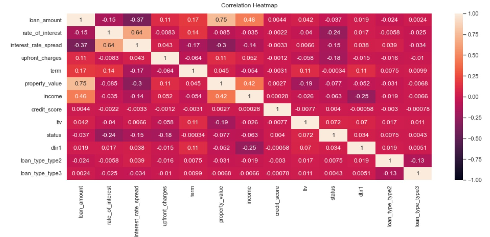
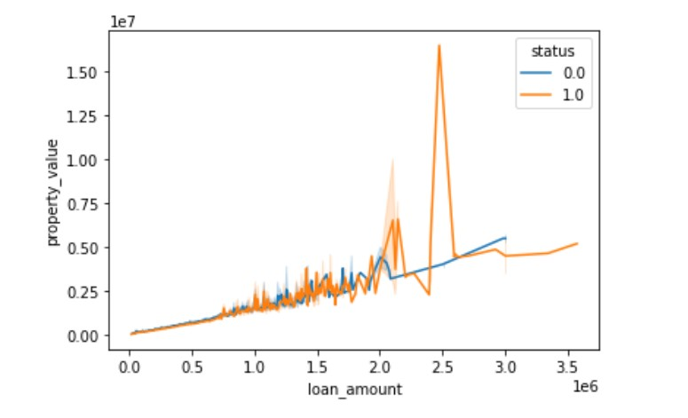

# Loan Default Prediction

*Lending loans is a significant source of revenue for banks, but it is not without risk. Loan defaults by borrowers are a common occurrence. To address this issue, we can use machine learning techniques to develop a robust model that can predict whether a new borrower is likely to default on their loan. The banks have gathered extensive data on past borrowers, and we can help to create a powerful machine learning model for this purpose. In this project, I will build classification model to predict weather the loan borrower will default or not.*

The Loan Default dataset was retrieved from Kaggle website and comes in a csv format. The dataset provided is vast and includes various deterministic factors such as borrower's income, gender, loan purpose, and more.

[Kaggle website](https://www.kaggle.com/datasets/yasserh/loan-default-dataset)

## 1. Data Wrangling

The raw data from Kaggle comprised of 148,670 Rows and 34 Columns. In order to enhance the efficiency of the model, I made careful decisions to exclude irrelevant columns that were unlikely to significantly influence the outcomes. Additionally, I eliminated duplicate entries and filled in missing values.

During the analysis, I delved deeply into various application features including loan amount, age, interest rate, status, property value, and income.

Lastly, I divided the data into categorical and numerical values, handling them separately. All values were then converted into numerical formats to cater to our machine learning model.

## 2. Exploratory Data Analysis

With our data now in a pristine state, I proceeded with exploration and analysis. I started with plotting the pairwise relationships and creating a heatmap, to check out how our variables relate to one another.

The findings from the EDA analysis of the variables and correlations revealed that the strongest positive correlation ((r=0.75) is between the **Loan amount** and **Property value** variables. This makes sense, as typically the higher loan amounts tend to correspond to more expensive properties. 

Several factors that can couse this correlation are:
- Market Demand and Property Prices: In areas where property prices are generally high due to strong demand or limited supply, borrowers may require larger loan amounts to afford properties in those markets.

- Property Evaluation: Property value is often assessed by considering factors such as location, size, amenities, condition, and market trends.

- Borrower Qualifications: Lenders evaluate borrowers' income, credit history, and debt-to-income ratio when determining loan amounts. Higher loan amounts may be approved for borrowers with higher incomes and better financial profiles, who are more likely to be able to afford properties with higher values.

Additionally, there was a moderately strong correlation between the **Rate of interest** and **Interest rate spread** (r=0.64). It appears that they are typically correlated because the interest rate spread is a measure of the difference between two interest rates. The interest rate spread is calculated by subtracting a reference interest rate (such as a benchmark rate) from the actual interest rate charged by a lender.

There were two weak-moderately strength negative correlations. The first, between **Loan amount** and **Interest rate spread** (r=-0.37), what can be influenced by multiple factors like market conditions, the borrower's credit history, the loan's duration, and the lender's pricing strategy. Lenders may be more willing to provide competitive rates and narrower spreads for larger loans as they perceive them to be less risky due to factors like the borrower's creditworthiness, collateral, or the potential profitability of the loan.

The second, between **Income** and **Debt-to-Income Ratio (DTIR)** (r=-0.25), what can be caused because the DTIR is calculated by dividing an individual's monthly debt obligations by their monthly income.
A lower DTIR indicates that a smaller portion of a person's income is allocated towards debt payments, which generally suggests a healthier financial position and better ability to manage debt. On the other hand, a higher DTIR indicates that a larger portion of income is allocated towards debt, which may suggest a higher risk of financial strain or difficulty in meeting debt obligations. Therefore, when income increases, assuming debt obligations remain constant, the DTIR decreases. This negative correlation means that as income rises, the proportion of income allocated to debt payments decreases, resulting in a lower DTIR. Conversely, if income decreases, the proportion of income allocated to debt payments increases, leading to a higher DTIR.
It's important to note that this negative correlation assumes debt obligations remain constant. If a person takes on more debt without a corresponding increase in income, the DTIR could increase even if income remains the same or decreases.

## 3. Algorithms & Machine Learning

The goal of the preprocessing work is to prepare our data for fitting models.

In the preprocessing step, we performed several tasks. First, we converted our categorical data into numerical format using the get_dummies() function in Section 3.2. This transformation allows us to work with categorical variables in our models effectively.

Afterwards, we proceeded to split our data into a training set and a test set. We allocated 70% of the data to the training set, which will be used to train our models. The remaining 30% was assigned to the test set, which will be used to evaluate the performance of our trained models on unseen data.

With the completion of these preprocessing steps, our data is now ready for the modeling phase. The training set will be utilized to build and train various models, while the test set will enable us to assess their performance and generalization capabilities.

By appropriately preprocessing the data, we have laid the foundation for effective modeling and can proceed with training and evaluating our models.

